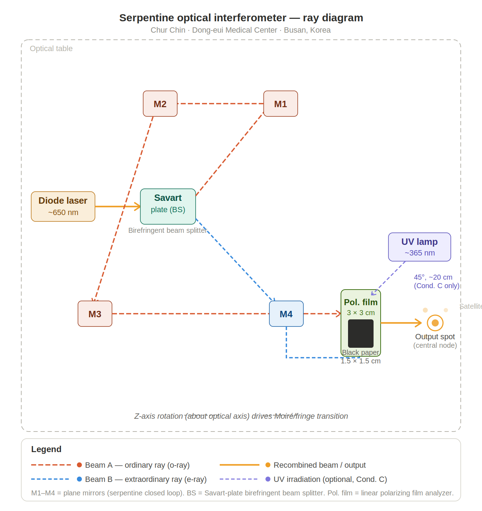

# Serpentine Optical Interferometer

**세르펜틴(링) 광학 간섭계** — Savart형 분할·경로를 바탕으로 **출사 빔이 한 점으로 되돌아오는** 세르펜틴 레이아웃 설계·조립 기록.

## CAD: 링 위 세르펜틴 레이아웃

파라메트릭으로 반사경을 링에 올린 모델 렌더링:

Ray diagram (uploaded layout sketch):

*If the CAD render is missing, add it as `media/serpentine-interferometer/images/cad/image-10.jpg`.*

## 실험 노트: Savart / Serpentine

## 벤치: 조립체

## 물리 요약 (노트 기준)

- 소각에서 광정차는 \(\theta\)의 **짝수 거듭제곱** 항이 지배적이며, 설계에 따라 한 팔에 \(\theta\)의 **선형** 항만 남길 수 있습니다.
- **위상민감 검출**로 DC·2차 성분을 걸러내면 남는 항으로 **각도·변위** 등을 읽을 수 있습니다.

## Manuscript

`docs/manuscripts/Serpentine Optical Interferometer.docx`
